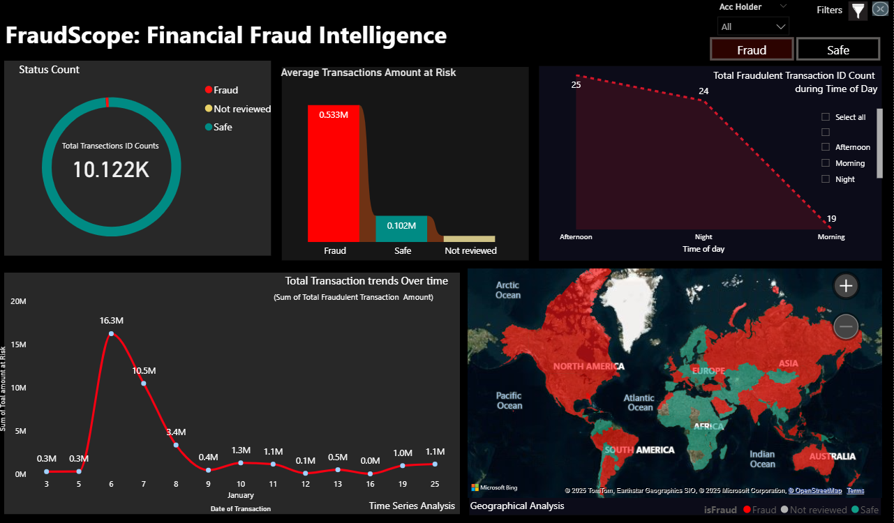
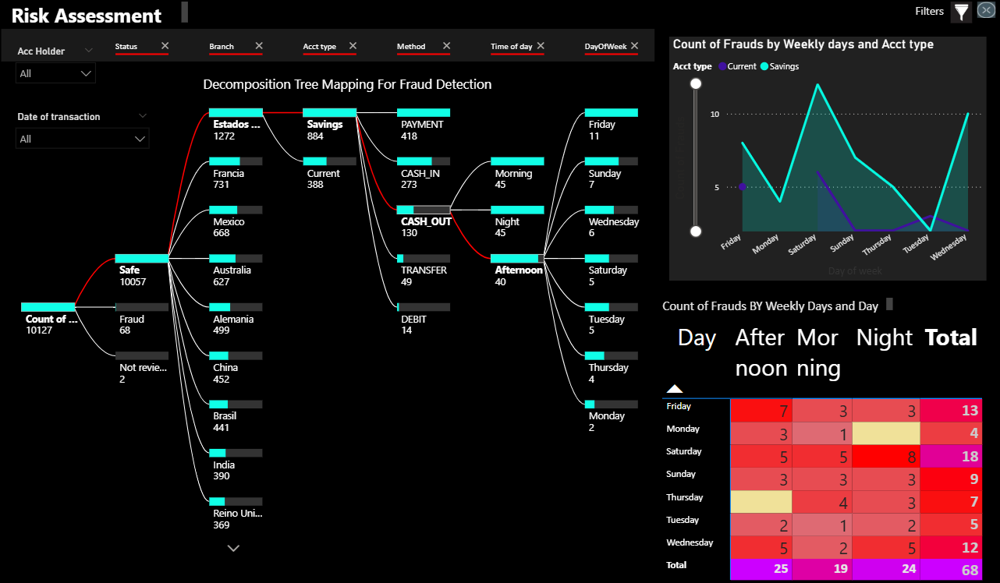
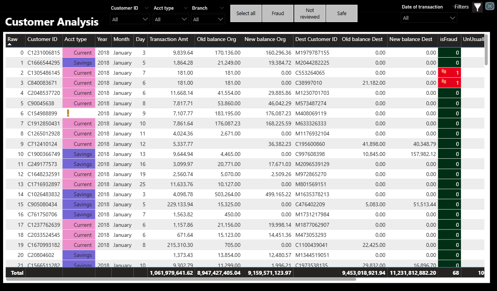
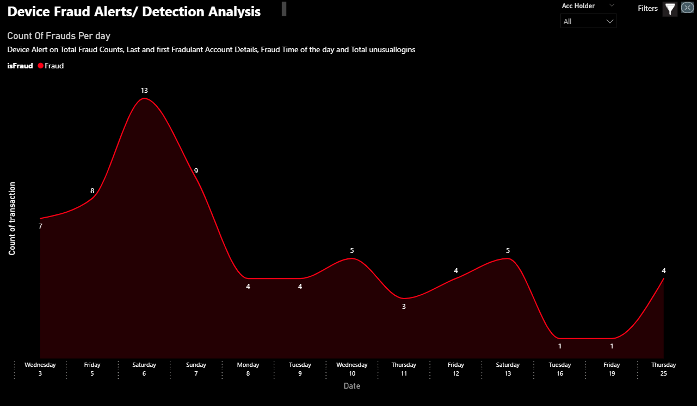
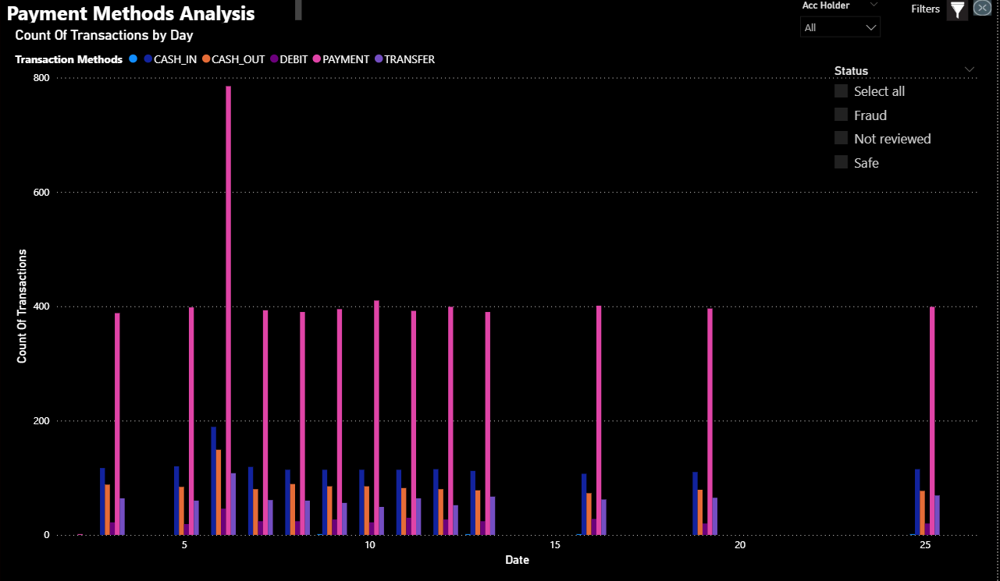
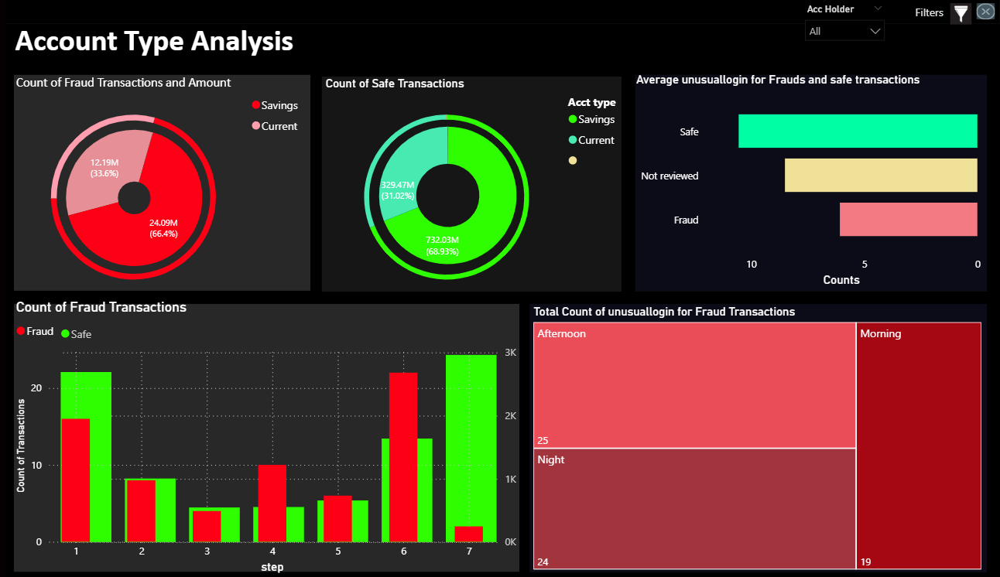

# 🔐 FraudScope: Financial Fraud Intelligence Dashboard

A comprehensive Power BI dashboard designed to detect, analyze, and visualize financial fraud trends across global transactions using interactive visualizations and KPI metrics.

## 🛠 Technologies Used

- **Power BI Desktop**
- **Power Query** (for cleaning & transforming data)
- **DAX** (KPI & time intelligence)
- **Custom Visuals:**
  - Decomposition Tree
  - Donut KPI cards
  - Heatmaps, Line charts, Treemaps, Bing Maps
- **Interactive Filters & Drillthrough**

---

## 📊 Dataset Summary

| Field             | Description                                       |
|------------------|---------------------------------------------------|
| `Customer ID`     | Unique ID for each transaction                   |
| `Transaction Amt` | Value transferred                                |
| `Account Type`    | Savings / Current                                |
| `isFraud`         | Binary flag for fraud                            |
| `UnusualLogin`    | Count of logins that triggered alerts            |
| `Method`          | CASH_IN, DEBIT, TRANSFER, etc.                   |
| `Time of Day`     | Morning / Afternoon / Night                      |
| `Day of Week`     | Used to derive temporal patterns                 |
| `Country/Branch`  | Geographical origin of transaction               |

---

## 📊 Project Objective

FraudScope is a dynamic financial fraud intelligence dashboard that helps fraud analysts, financial institutions, and decision-makers:
- Identify fraudulent transactions by time, geography, and method
- Analyze customer behavior, device patterns, and fraud peaks
- Reduce false positives through contextual filters and unusual login indicators
- Take preventive actions using data-driven insights

---

## 📂 How to Run

1. Clone/download this repository
2. Open `FraudScope.pbix` in Power BI Desktop
3. Use filters like:
   - `Status`, `Acc Holder`, `Date`, `Method`, `Time of Day`
4. Click through each page to analyze fraud patterns interactively

---

## 🧩 Page-by-Page Breakdown

---

### 📌 1. **Dashboard Overview** (`dashboard.png`)

This page gives a snapshot of fraud risk across multiple dimensions:

- **Status Count (Donut Chart):**  
  Shows **10,122 total transactions**, categorized into:
  - 🟥 **Fraud:** Actively flagged fraudulent transactions
  - 🟡 **Not Reviewed:** Pending status evaluation
  - 🟢 **Safe:** Verified safe transactions

- **Average Transactions Amount at Risk (Bar Chart):**  
  - Fraud: **$0.533M**
  - Safe: **$0.102M**
  - Shows the financial impact of fraud compared to safe behavior

- **Time of Day Analysis (Line Chart):**  
  - Afternoon: 25 frauds
  - Night: 24
  - Morning: 19  
  Indicates higher fraud rates during non-business hours

- **Transaction Trend Over Time (Line Graph):**  
  - Peak on **January 6** with **$16.3M** in fraudulent activity
  - Followed by a sharp drop, reflecting potential detection/intervention
  - Tracks total daily at-risk transaction value

- **Geographical Fraud Heatmap (World Map):**  
  - 🟥 Red: Fraud-prone countries (USA, France, Mexico, etc.)
  - 🟢 Green: Safe zones  
  Provides a global risk distribution for fraud investigations

---

### 🧠 2. **Fraud Decomposition Tree** (`fraud_tree.png`)

An intelligent breakdown of fraud patterns across several variables:

- **Decomposition Tree Visual:**
  - Begins with `Status` → `Country` → `Account Type` → `Method` → `Time of Day` → `Day of Week`
  - Top fraud branches:
    - **Estados Unidos** → **Savings** → **PAYMENT** → **Morning** → **Friday**
    - **Francia** → **Current** → **CASH_OUT** → **Night**
  - Provides explainability in fraud origin

- **Line Chart (Weekly Trend by Account Type):**
  - **Current accounts** see more fraud midweek
  - **Savings accounts** spike on **Friday and Sunday**

- **Heatmap (Time of Day × Day of Week):**
  - Highest fraud counts:
    - **Friday Afternoon:** 13 frauds
    - **Sunday Night:** 8 frauds
    - **Saturday Morning:** 7 frauds

---

### 👥 3. **Customer Analysis** (`customers.png`)

A detailed transactional table enabling fraud profiling at the individual level:

- Columns include:
  - `Customer ID`, `Account Type`, `Transaction Date`, `Amounts`, `Old/New Balance`, `Destination IDs`
  - `isFraud` Flag (1 = Fraud)
  - `UnusualLogin` Flag (1 = Suspicious access pattern)

- **Observations:**
  - Fraud flagged transactions have imbalance in debit/credit behavior
  - Customers with frequent unusual logins often overlap with fraud tags

- **Grand Totals:**
  - Total Transactions Amount: **$1.06B**
  - Total Fraud Count: **68**
  - Verified Safe Transactions: **10,057**
  
Useful for fraud auditing, KYC validation, and anomaly detection.

---

### 💻 4. **Device-Based Alerts** (`device.png`)

Highlights fraud activity detected based on device usage patterns:

- **Line Graph (Frauds by Day):**
  - Peak of 13 frauds on **Saturday 6th**
  - Consistent dips on Tuesdays and Wednesdays
  - Suggests behavioral patterns of fraud actors based on weekends

- **Use Case:**  
  Helps identify devices/IPs exhibiting bot-like or unusual behavior

---

### 💳 5. **Payment Method Trends** (`methods.png`)

Shows transaction volume by method and date:

- **Methods Tracked:**
  - 🔵 CASH_IN
  - 🟣 CASH_OUT
  - 🟠 PAYMENT
  - 🟡 DEBIT
  - 🔴 TRANSFER

- **Insights:**
  - PAYMENT and CASH_OUT are the most frequent fraud-linked methods
  - Repeating spikes across multiple days indicate potential method misuse

- **Filterable by:**
  - Account Holder
  - Status (Fraud / Safe / Not Reviewed)

---

### 🏦 6. **Account Type Analysis** (`accounts.png`)

Deep dive into how account types influence fraud patterns:

- **Donut Charts:**
  - Fraudulent Amounts:
    - **Current Accounts:** $24.09M (66.4%)
    - **Savings:** $12.19M (33.6%)
  - Safe Transactions:
    - **Current:** $732.03M
    - **Savings:** $329.47M

- **Average Unusual Login:**
  - Fraud: ~4.5 per account
  - Safe: ~10 (suggests false positives are rare in high login counts)

- **Treemap (Login Time of Day):**
  - Afternoon: 25
  - Night: 24
  - Morning: 19  
  Emphasizes fraud peaks during low-monitoring windows

---

## 📌 Key Insights Summary

- 📅 Peak Fraud Date: **January 6** ($16.3M)
- 🏦 Current Accounts: **2x more vulnerable than savings**
- 🕔 Top Fraud Time: **Afternoon and Night**
- 🌍 Top 3 Risk Countries: **USA**, **France**, **Mexico**
- 💳 Risky Methods: **PAYMENT** & **CASH_OUT**

---

## 👨‍💻 Author

**Parth Gawande**  
🎓 M.S. Data Science, RIT  
🔗 [LinkedIn](https://www.linkedin.com/in/parthgawande)  
🌐 [Portfolio](https://parthgawande.github.io/Portfolio)

---

## 📜 License

Licensed under the [MIT License](LICENSE).  
For educational and non-commercial use only.

